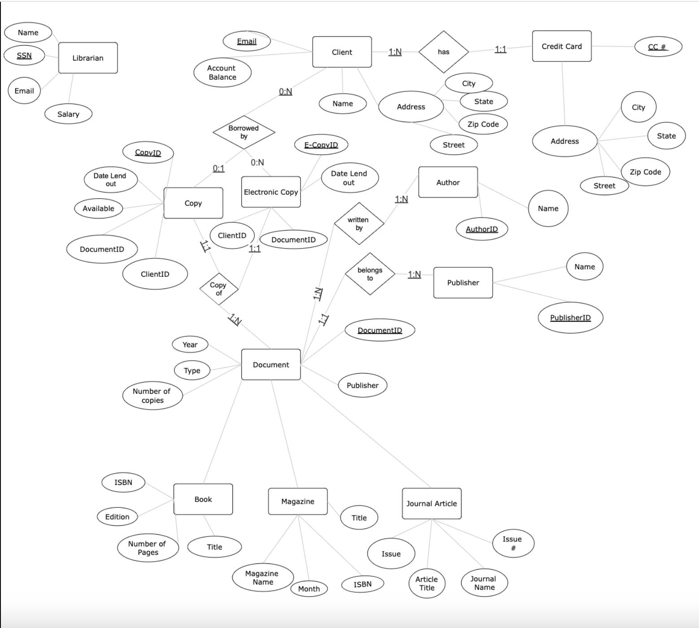
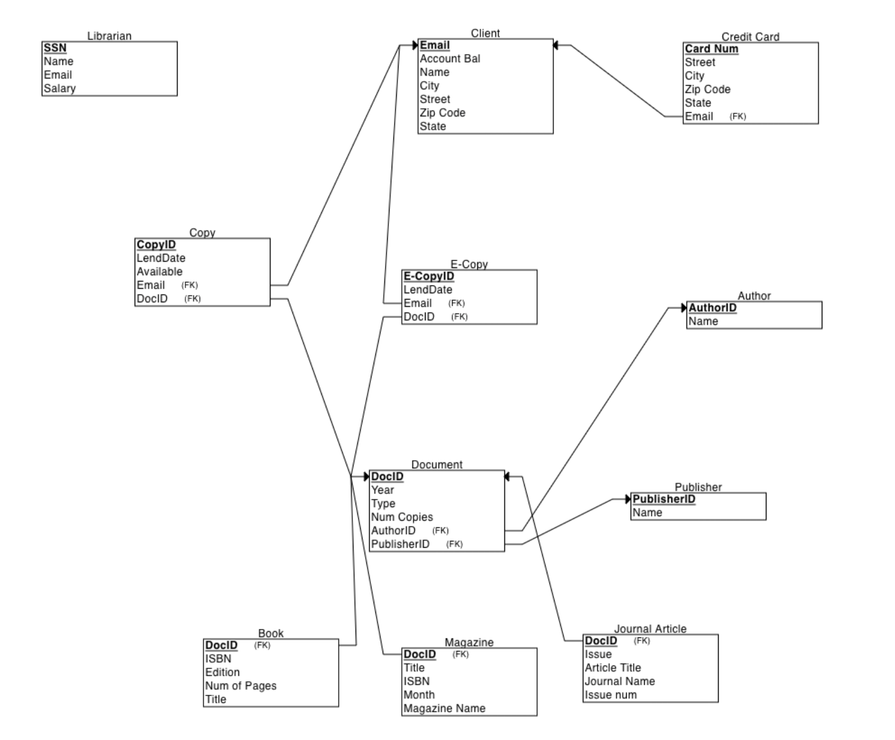

# 📚 Library Management System (Python + PostgreSQL)

A full-stack database application developed using **Python** and **PostgreSQL** to manage and track library resources and client interactions. The system includes a relational database, backend logic for common operations, and structured schema management to support efficient and scalable library operations.

🔗 [View the GitHub Repository](https://github.com/ShariarN96/CS480--Library-management-system-database)

---

## 🧠 Methodology

We began by gathering and analyzing the functional requirements for a typical library management system. This involved identifying key entities and interactions required for efficient resource management, such as:

- 📘 **Document**
- 👨‍💼 **Author**
- 🏢 **Publisher**
- 📄 **Copy**
- 👤 **Client**

These requirements were translated into:
- An **Entity-Relationship (ER) Diagram**
- A **relational schema**
- The corresponding **PostgreSQL tables and DDL commands**

---

## 🗂️ ER Diagram

The database structure was first designed using an **Entity-Relationship diagram**, defining all key entities and their relationships.

---

## 🧱 Relational Schema

The ER diagram was mapped into a relational schema with:
- Primary and foreign key constraints
- Table relationships
- Normalized design for efficient querying and data integrity
- 

---

## 🛠️ Data Definition (DDL)

PostgreSQL **DDL commands** were written to define the schema and set up the database structure programmatically, including `CREATE TABLE`, `PRIMARY KEY`, `FOREIGN KEY`, and indexing commands.

---

## 💻 Backend Logic in Python

Python was used as the backend driver for database interactions. Using **psycopg2**, we developed reusable functions to handle core operations like:

- Adding new books, copies, or clients
- Querying availability of specific documents
- Managing borrowing/return logic
- Searching documents by author, publisher, or title

🔗 [View the Python Code](https://github.com/ShariarN96/CS480--Library-management-system-database/blob/main/CS480_Group11%20(1).py)

---

## 🧰 Tools & Technologies

| Tool         | Purpose |
|--------------|---------|
| **Python**   | Backend logic implementation |
| **PostgreSQL** | Relational database design and storage |
| **psycopg2** | PostgreSQL adapter for Python |
| **Lucidchart** | Visual ER diagram creation |
| **Git & GitHub** | Version control and collaboration |

---

## 📬 Contact

**Shahriar Namvar**  
📧 snamva2@uic.edu  
🌐 [Portfolio](https://shanenn.carrd.co)  
🔗 [LinkedIn](https://www.linkedin.com/in/shanenn)

---

## 📄 License

MIT License
